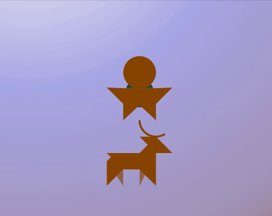
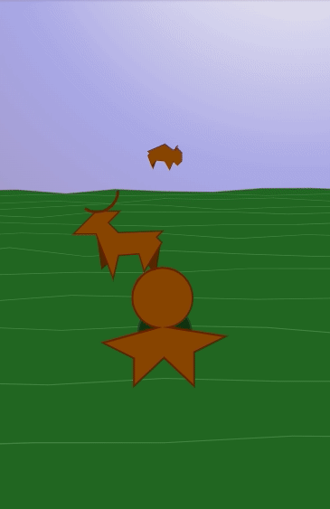
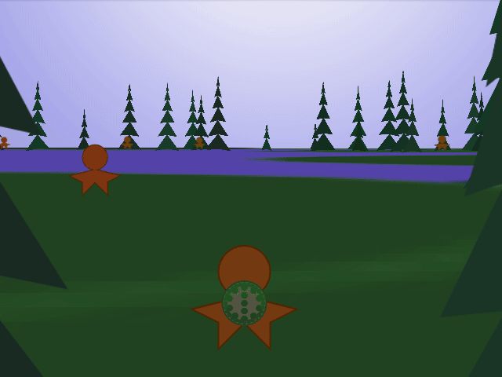
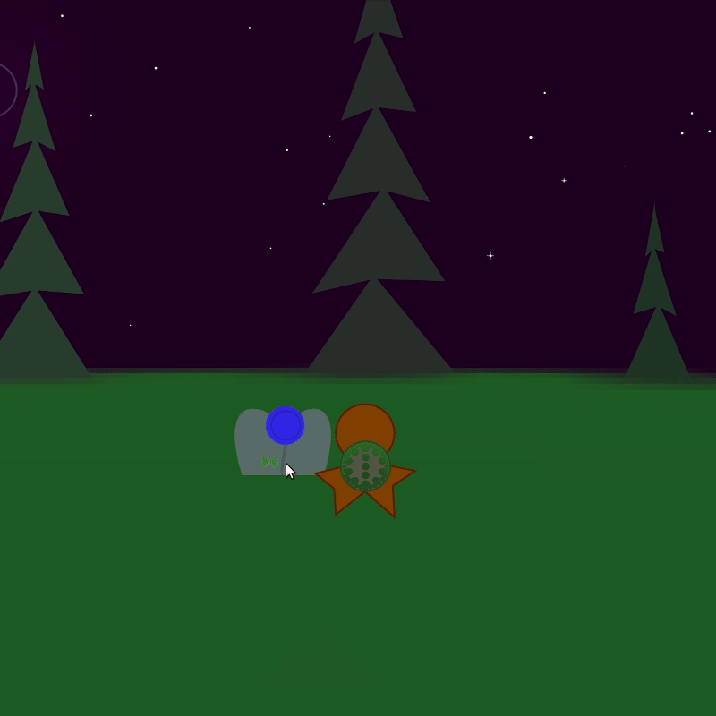

# 13 Drums

A [js13kgames](https://js13kgames.com) 2023 entry. Explore the Americas in the 13th Century, gathering resources and learning skills, and collect all 13 drums.

This game is best experienced with sound, so good headphones or speakers are recommended.

## Controls

### Keyboard

* `w`, `a`, `s`, `d`: Movement
* `shift`: Hold down to run
* `esc`: Pause/Resume
* `i`: Toggle Debug (not in the final build)

### Mouse
* `click`: Interact where available

## Entities

1. **Person** - Can be traded with, and will award drums during the nightly drum circle.
2. **Tree** - Can be collected for Wood.
3. **Stone** - Can be collected
4. **Flower** - Can be collected. There is 1 flower for every phase of moon, blooming on it's associated evening.
5. **Grass** - Can be collected
6. **Bush** - Can be collected for Sticks
7. **Deer** - Can be collected for Hide
8. **Bison** - Can be collected for Fur

## Drums

Each drum unlocks a new ability, assisting you in your journey, and adding to the music.

1. **Village** - Enables TRADE - Interact with all 3 villagers
2. **Basket** - Enables 3 INVENTORY - 3 Grass
3. **Crops** - Enables PLANTING - 3 Corn
4. **Hatchet** - Enables WOOD collection - 1 Stick, 1 Grass, 1 Stone
5. **Bow** - Enables DEER hunting - 2 Stick, 1 Stone
6. **Spear** - Enables BISON hunting - 2 Wood, 1 Stone
7. **Deer** - Enables ??? - 3 Deer hide
8. **Bison** - Enables ??? - 3 Furs
9. **???** - Enables ??? - ???
10. **Boat** - Enables WATER movement - 1 Deer hide, 2 Wood
11. **?Dream Catcher**? - Enables  ???
12. **Medicine** - Enables CLOUD travel to get to the final village - 1 Flower, 1 Mushroom, 1 Feather
13. **Shell** - Enables NEW GAME - 

## Dev Log

* Ideation
* Utilities
* Initial rendering engine
* Initial game loop
* Day night cycle
* Sound
* Player and quadruped animation
* Player controls
* Build system
* Code cleanup
* Git integration

### 2023-08-13

Driving home 13 hours from Michigan and pondering on the idea it seemed likely that most entries would be Eurocentric. Opting for a

### 2023-08-15

Initial utilities and decisions on possible game mechanics.

### 2023-08-16

`MAKE` and some of the initial minimization techniques.

### 2023-08-21

Getting the basic walking animation for bipeds and quadrupeds was an important early step once the basic engine and utilities were in place.

The backdrop Day/Night cycle, with a little animation, should make for a simple bit of early "polish" and allows for experimenting with various animations.

### 2023-08-27

Initial ideas for having a "round" world using non-Euclidean perspective, featuring some random walks from the Bison and some initial movement controls.

### 2023-08-31

Trying out a different approach to project a 2D world map into the 2.5D perspective seems to produce a rather decent effect, and projecting on top of this appears to be effective

### 
Adding in some trees and villagers to start populating the world.

### 2023-09-06

Added collection of Flowers and Wood from Trees, plus a basic inventory rendering. While not restricted to Drums, and without any limits on collection, the basic mechanics should provide most everything else needed for interactions (minus animations). One thing I have considered is what to do with items you might collect that are unnecessary. Some could be burned to the fire, but perhaps the villages or villagers should always accept items as a way to clear inventory and promote interaction.

